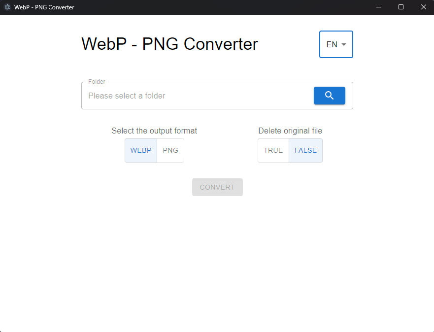

- [日本語 JP](README_JP.md)

# WebPexer


This is a tool for converting image files between WebP and PNG formats (mainly for personal use).



## Stack

- [Electron](https://www.electronjs.org)
- [Vite](https://vitejs.dev)
- React
- [MUI](https://mui.com/)
- [sharp](https://sharp.pixelplumbing.com/)

## Recommended IDE Setup

- [VSCode](https://code.visualstudio.com/) + [ESLint](https://marketplace.visualstudio.com/items?itemName=dbaeumer.vscode-eslint) + [Prettier](https://marketplace.visualstudio.com/items?itemName=esbenp.prettier-vscode)

## Project Setup

### Install

```bash
$ npm install
```

### Development

```bash
$ npm run dev
```

### Build

```bash
# For windows
$ npm run build:win

# For macOS
$ npm run build:mac

# For Linux
$ npm run build:linux
```

## Contribution

If you find any bugs in the source code, it would be helpful if you could create an Issue on the GitHub repository.  
It would be even more helpful if you could fix the bug and submit a Pull Request.

## Author

Yuma Shintani ([@yuma-shin](https://github.com/yuma-shin))

## License

- The MIT License (MIT)
