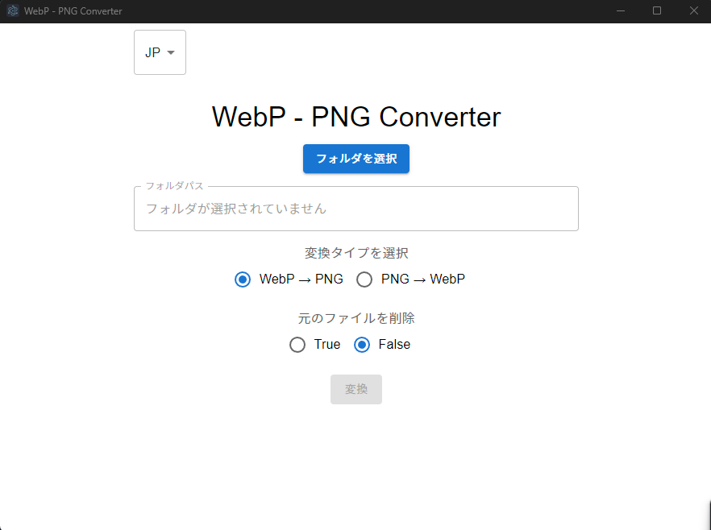

- [English US](README.md)

# WebPexer


画像ファイルのwebpとpngの相互変換をするツールです。(主に自分で使う用)



## Stack

- [Electron](https://www.electronjs.org)
- [Vite](https://vitejs.dev)
- React
- [MUI](https://mui.com/)
- [sharp](https://sharp.pixelplumbing.com/)

## IDEのセットアップ

- [VSCode](https://code.visualstudio.com/) + [ESLint](https://marketplace.visualstudio.com/items?itemName=dbaeumer.vscode-eslint) + [Prettier](https://marketplace.visualstudio.com/items?itemName=esbenp.prettier-vscode)

## プロジェクトのセットアップ

### インストール

```bash
$ npm install
```

### 開発環境

```bash
$ npm run dev
```

### ビルド

```bash
# For windows
$ npm run build:win

# For macOS
$ npm run build:mac

# For Linux
$ npm run build:linux
```

## コントリビューション

ソースコード上でバグを発見されたら、GitHub 上の Repository にて Issue を作成していただけると助かります。  
バグを修正して Pull requests を提出していただけるとさらに助かります。

## Author

Yuma Shintani ([@yuma-shin](https://github.com/yuma-shin))

## ライセンス

- The MIT License (MIT)
